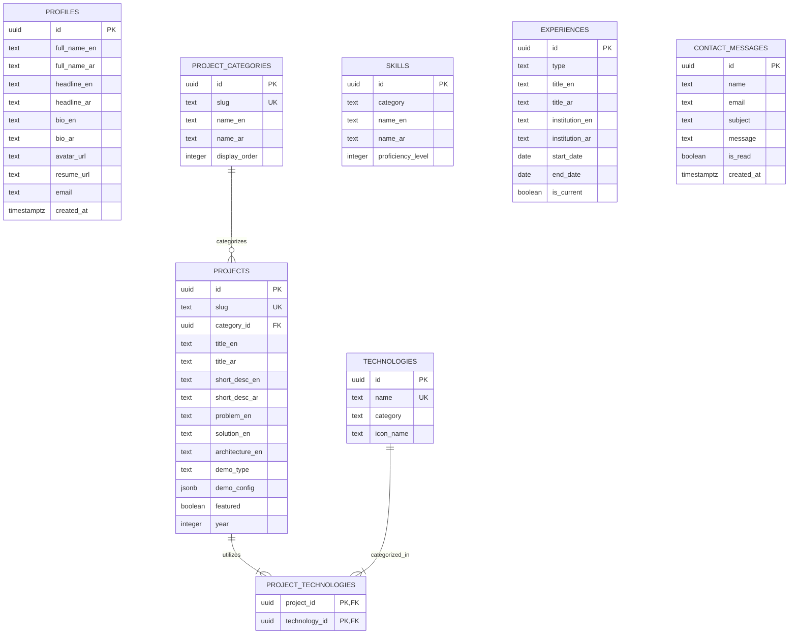

# 12 — ENTITY RELATIONSHIP DIAGRAM (ERD)

**Project:** Abdulghani Al-Shibami — Autonomous Personal Portfolio Engineering System  

---

## 1. Visual Entity Relationship Model

---

## 2. Integrity Rules
1. Deleting a category sets `category_id` in `projects` to NULL (preventing cascade loss of case studies).
2. Deleting a project cascades into `project_technologies` join records cleanly.
3. Slugs must be alphanumeric with hyphens, normalized to lower-case.
