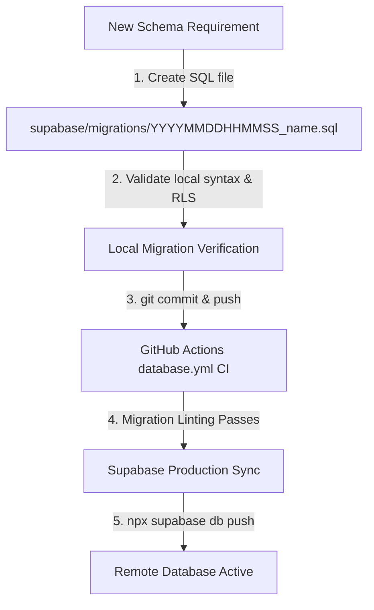

# Deployment Runbook & Operational Workflows

**System:** Abdulghani Al-Shibami — Autonomous Portfolio Platform  
**Standard:** Enterprise CI/CD & Production Governance  
**Date:** 2026-09-19  

---

## 1. Application Release Lifecycle

```mermaid
graph TD
    A[Local Feature Branch / Working Tree] -->|1. pnpm typecheck & pnpm lint| B[Local Code Verification]
    B -->|2. git commit -m 'feat(...)'| C[Local Commit Created]
    C -->|3. git push origin branch| D[GitHub Remote]
    D -->|4. GitHub Actions CI Triggered| E{CI Passing?}
    E -->|No| F[Review Failure & Patch Code]
    E -->|Yes| G[Vercel Preview Deployment]
    G -->|5. Browser QA Inspection| H{Staging Approved?}
    H -->|No| F
    H -->|Yes| I[Merge Pull Request into main]
    I -->|6. Automated Deployment| J[Vercel Production Release]
```

### Operational Steps:
1. **Local Validation:**
   ```bash
   pnpm typecheck
   pnpm lint
   pnpm build
   ```
2. **Commit Changes:**
   ```bash
   git add .
   git commit -m "feat(scope): descriptive message"
   ```
3. **Push to Remote:**
   ```bash
   git push origin main
   ```
4. **CI Verification:**
   Monitor GitHub Actions status at `https://github.com/Abdulghani780/Abdulghani-AlShibami-Portfolio/actions`.
5. **Preview & Production Check:**
   Inspect live deployment on Vercel preview/production URL across mobile and desktop.

---

## 2. Database Schema Release Lifecycle



### Operational Steps:
1. **Create Timestamped Migration:**
   ```bash
   # In supabase/migrations/
   touch supabase/migrations/20260919000002_feature_name.sql
   ```
2. **Apply RLS & Indexes:**
   Ensure every table has `ENABLE ROW LEVEL SECURITY` and explicit policies.
3. **Validate in CI:**
   The `.github/workflows/database.yml` workflow automatically scans for SQL formatting and prevents plaintext credential leaks.
4. **Deploy to Supabase:**
   ```bash
   npx supabase link --project-ref <your-project-ref>
   npx supabase db push
   ```

---

## 3. Rollback Procedures

### Application Rollback
If a regression occurs in production:
1. In the Vercel Dashboard, navigate to **Deployments**.
2. Select the previous stable deployment.
3. Click **Instant Rollback**.

### Database Migration Rollback
1. Author a dedicated down-migration: `YYYYMMDDHHMMSS_revert_feature_name.sql`.
2. Apply via `npx supabase db push`.
3. Never manually alter live tables or drop production columns without backward-compatible migration phases.
